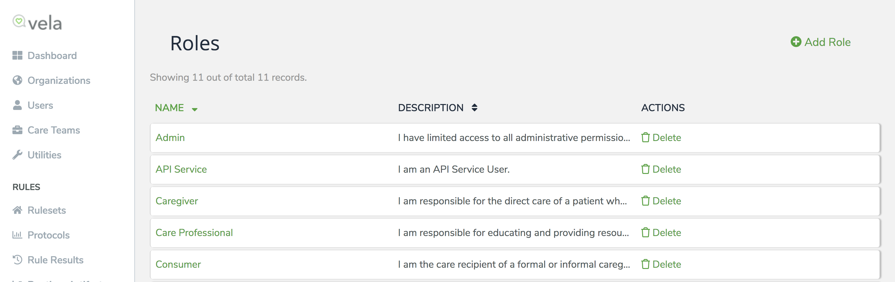
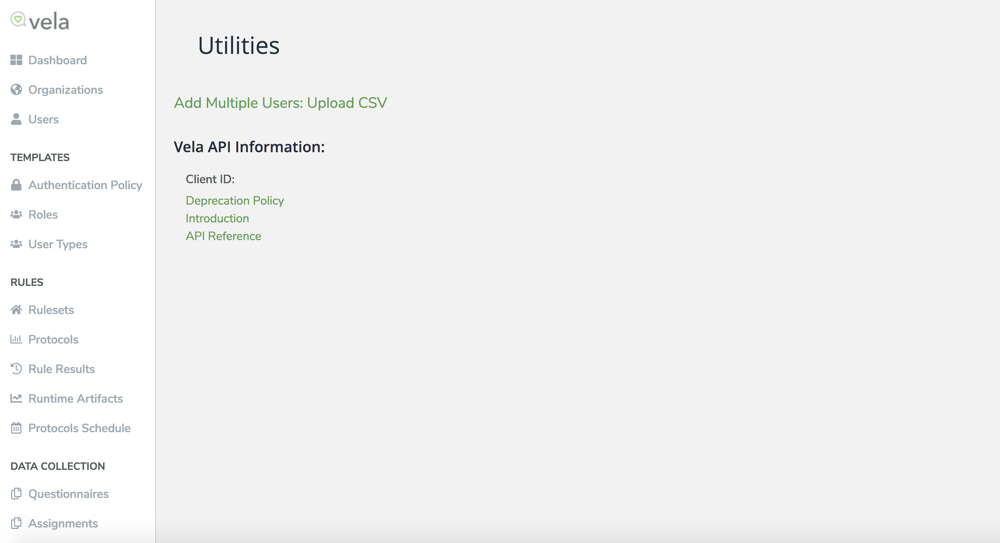
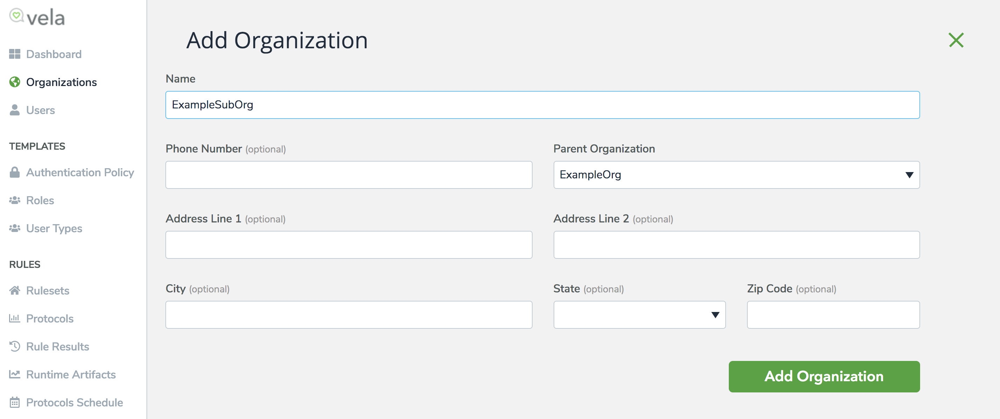

# Overview

The Vela public api is designed to provide a rational, unified interface for Partners to interface with the Vela system

## Swagger
The swagger for the Vela Public API is available at https://app.vela.care/public/api/docs/ for production and https://app.beta.alwaysreach.net/public/api/docs/ for the beta environment.  The beta environment is updated 3 weeks prior to a release to facilitate integration testing.

## Utilizing public api

All endpoints require authorization -- to use the public api the caller must have the public api permission associated with their account.

The APIs are broken up into several sections - admin for user and care team data, care data for information
regarding the care of a specific user and the events section -- which uses queues and webhooks to inform the 
partner of what data has been created or changed as it happens within the system.

This is a Restful api, and follows standard conventions.  A user must have the public_api permission in Vela to access it.

With the exception of the authorize endpoint, all endpoints require a valid authorization bearer token in the header and take in request data that is content-type "application/json". Operations can be performed against all of them.

Operations against an existing user profile require the id parameter.  This ID is the reference provided to Vela when the record is created, not the internal id to Vela, if one was not supplied one was generated.
This ID is unique to your partner organization and is supplied for ease of integration.
	Example of flow:
		1) Get a token
		2) Get the user by id
		3) Patch the user by id

## Getting a token

Vela uses an oauth style token.  The client ID is available on your organization's "Utility" page in the vela Admin application.

Pass the client_id, a grant_type of "password" and the username and password as form params to the endpoint and it will respond with the following:
	{
	  "access_token": "string",
	  "client_id": "string",
	  "client_name": "string",
	  "email": "string",
	  "expires_in": 0,
	  "password_changed_at": "2020-08-06T18:47:09.438Z",
	  "refresh_token": "string",
	  "token_type": "string",
	  "username": "string",
	  "uuid": "string"
	}

All other api calls (except where noted) require this oauth style token to access the resources.  So attach an `Authorization` header of type `bearer` with the access token's value to each request -- so for token value of "abcd" you would make a header of `Authorization` with the value `bearer abcd`.  The expires_in values is in seconds -- tokens at this time default to 4 hours in length (14400 seconds).
At this time we do not expose an endpoint to refresh the token. Any request made without a valid token will return a 401 error code.

## Care teams:
A care team is a consumer and the professional and non-professional people dedicated to their Care
A care team has its own id - used to reference it.
This id can be recovered by getting it by consumer -- example (have ref to consumer, get care team by consumer id, get ID from response)
Operations:
  Removing/adding a member.
  Updating care team.

## User profiles:
A user is a person who can participate in the Vela applications.
All user manipulations are under user-profiles in the API.
There are 4 types of users in Vela:
	-Patients (consumers)
	-Caregivers
  -Professionals
  -Administrators.  
Every user is a member of an organization, and visibility of other users is controlled by the organization hierarchy.
Create users.
Can get by email -- which also checks username.
Updating requires the ID.
Can update the ID - patch to old id value - set new id value in the request.

## User suspensions
Putting a user on suspension is like a temporary disenrollment from the program.
They will not be responsible for completing questionnaires during a suspension period.
  A suspension requires a start date, but the end date is optional; if not provided the person is suspended until the suspension is closed.
  Suspensions can be attained by user id -- all operations to modify one require the id.
  Suspensions can be closed by updating them with an end date.
  All operations to modify one require the id of the suspension.
  Operations:
    Creations are on the user - and an id will be returned
    Get list by user id
    Post to user id
    Update, Delete, Get (by id)


## Organizations:
All organizations descend from a partner_id -- the root of your organization tree.
Orgs can be added anywhere in your tree or moved. Moving a parent organization moves all its children with it.
Example of creating a sub org within an organization:
  
  
Operations:
  -Create (post to the id of the parent organization)
  -Update by id (put and patch)
  -List all organizations that are descendants of the id

## Care data
This is all data specific to a care team - its messaging, and questionnaires related to patient care.
### Attachments
  Can be uploaded (post), the information about them can be returned (get) and the attachment itself can be downloaded with the download endpoint - the get returns information about the attachment, the download returns the attachment itself
### Private Messages
  The post to private messages allows allows the user to send a message to a group of users on a care team.  The focus_id identifies the patient the message is about.  If the team_chat is set to true it uses a team channel on the foc_id's care team.
  Otherwise it finds or builds a chat to the members of the to_list - in a chat for the focus_id.  An existing chat channel will be used if one exists - otherwise a new one will be built.
  The get endpoint gets any message that fits the parameters supplied - for a given user (required), and for a date interval, the chat logs are searched for any message that matches the criteria.

### Questionnaires
  The submission by id endpoint gets one submitted questionnaire that matches the id.  The GET endpoint returns any questionnaire for the required user that fits the criteria.

## Rate Limiting
Access to the vela APIs is rate limited by a simple leaky bucket algorithm with a shared key so multiple server instances share the same counter.
If you have exceeded your allotment, a 429 error can be returned from any endpoint.
Usage statistics can be viewed at the "/events/usage-by-type" endpoint.

## Events
The queues allow data to be pulled from the system to the partner.  The events are a time series of everything happening in vela.
The different types of events are as follows:
  user-login
  user-created
  user-updated
  organization-created
  organization-update
  organization-deleted
  user-suspension-created
  user-suspension-updated
  user-suspension-deleted
  care-team-created
  care-team-updated
  private-message-sent
  private-message-updated
  alert-message-created
  alert-message-updated
  alert-message-deleted
  questionnaire-created
  questionnaire-updated
  questionnaire-deleted
  questionnaire-assignment-created
  questionnaire-assignment-updated
  questionnaire-assignment-deleted
  questionnaire-assignment-submitted
    A current list of event_types can be gotten from the event-types GET endpoint.

## Queues:
A queue is defined for you at each partner organization.  It can be edited with the patch endpoint -- and the events types desired.
The default is to receive them all.
Information can be received about the queue by calling the get endpoint.
It can be updated with the patch endpoint.
Set the event_types value to the ones you wish to receive - and empty array is every event by default.
Whenever desired you can pull events from the queue using GET /api/v1/events/queue/events.
Every queue has a watermark, when you GET from the queue it returns the next X records (for now a max of 100).
	The get returns {
  	"events": [
      {
        "created_at": "2020-08-07T16:37:20.182Z",
        "event_type": "string",
        "event_type_id": 0,
        "id": 0,
        "message_source": "string",
        "message_timestamp": "2020-08-07T16:37:20.182Z",
        "message_uuid": "string",
        "organization_id": 0,
        "partner_id": 0,
        "payload": {}
      }
      ],
      "last_read_index": 0
      }
You receive an array of records and the last_read_index -- which is your new watermark.
After you have received the records you should update the watermark -- to the value returned from the GET. PUT /api/v1/events/queue/watermark
This advances the cursor in the queue.  This is done to ensure that the delivery has occurred and no records are lost, since the system only knows that the records were sent - not that they were successfully received.
The watermark and event_types are completely under your control.  You can reset them at will.  You can rewind at will and change what event types at any time.
Operations:
  -Return a queue for the organization of an admin or for the provided organization if the caller is a service user .
  -Return events of the queue for the organization of an admin or for the provided organization if the caller is a service user.
  -Update the watermark of a queue for the organization of an admin or for the provided organization if the caller is a service user .

## Webhooks:
A webhook is similar to a queue.  Except it pushes from the server to the client, rather than the client making requests.
When a webhook is activated it wakes up on a timer and delivers the data to a predefined URL it can post to.
It will continue making deliveries until its data is exhausted (or the user tells it to stop, by pre-arranged contract).
Otherwise, it behaves the same as the queues.

#Appendix of Event Types


id |                slug
----+------------------------------------
| 1 | user-login
| 2 | user-created
| 3 | user-updated
| 4 | organization-created
| 5 | organization-updated
| 6 | organization-deleted
| 7 | user-suspension-created
| 8 | user-suspension-updated
| 9 | user-suspension-deleted
| 10 | care-team-created
| 11 | care-team-updated
| 12 | private-message-sent
| 13 | private-message-updated
| 14 | alert-message-created
| 15 | alert-message-updated
| 16 | alert-message-deleted
| 17 | questionnaire-created
| 18 | questionnaire-updated
| 19 | questionnaire-deleted
| 20 | questionnaire-assignment-created
| 21 | questionnaire-assignment-updated
| 22 | questionnaire-assignment-deleted
| 23 | questionnaire-assignment-submitted
#Structure of Each event type

## Event type 1
```json
{
  "client_application": "ADMIN_WEB",
  "oauth_client_id": "14e4009f-f761-4d44-9ee3-5caacada6dc6.vela.care",
  "recorded_at": "2019-04-24T15:15:39Z",
  "user_id": "vela_default_347",
  "username": "beta_cm"
}
```
## Event-types 2, 3
```json
{
  "address_line1": null,
  "address_line2": null,
  "address_line3": null,
  "address_line4": null,
  "address_line5": null,
  "address_line6": null,
  "archived_at": null,
  "archived_by": null,
  "birthday": null,
  "city": null,
  "country": null,
  "created_at": "2019-04-24T17:51:03Z",
  "created_by": "V00000000010000000001",
  "disabled_at": null,
  "disenrolled_at": "3016-03-25T00:00:00Z",
  "email": "zzzzz+whynoput@gmail.com",
  "enrolled_at": "2019-04-24T17:50:01Z",
  "extended_properties": null,
  "first_name": "mike",
  "first_sign_in_at": null,
  "gender": "UNSPECIFIED",
  "id": "V00000091790000000001",
  "language": "en",
  "last_name": "example-ppe",
  "middle_name": null,
  "needs_onboarding": false,
  "organization_id": 1,
  "partner_id": 1,
  "primary_phone_number": "1115551212",
  "second_email": null,
  "secondary_phone_number": null,
  "state": null,
  "tertiary_phone_number": null,
  "timezone": "America/New_York",
  "updated_at": "2019-04-24T17:51:03Z",
  "updated_by": "V00000000010000000001",
  "user_type_category": "ADMIN",
  "user_type_id": 105,
  "user_type_name": "Admin",
  "username": "zzzzz+whynoput@gmail.com",
  "uuid": "eddc81ed-f5f5-4afe-91cd-2e595da922b8",
  "zip": null
}
```
## Event types 4, 5, 6:
```json
{
  "address_line1": null,
  "address_line2": null,
  "city": null,
  "created_at": "2019-04-24T22:10:18Z",
  "created_by": "vela_default_da2161f4-246e-446f-ae38-1315dd370b11",
  "email": null,
  "id": 392,
  "name": "Chewbacca",
  "parent_id": 83,
  "partner_id": 4,
  "phone_number": null,
  "state": null,
  "updated_at": "2019-04-24T22:10:18Z",
  "updated_by": "vela_default_da2161f4-246e-446f-ae38-1315dd370b11",
  "zip": null
}
```
## Event types 7, 8, 9, 10:
```json
{
  "authorized_at": null,
  "authorized_by": null,
  "consumer_user_id": "V00000091830000000004",
  "created_at": "2019-04-24T22:11:32Z",
  "created_by": "vela_default_da2161f4-246e-446f-ae38-1315dd370b11",
  "id": 3850,
  "member_changes": null,
  "members": [],
  "organization_id": 4,
  "status": "created",
  "updated_at": "2019-04-24T22:11:32Z"
}
```
## Event type 11:
```json
{
  "authorized_at": "2019-04-24T22:19:50Z",
  "authorized_by": "V00000091870000000004",
  "consumer_user_id": "V00000091870000000004",
  "created_at": "2019-04-24T22:18:59Z",
  "created_by": "vela_default_da2161f4-246e-446f-ae38-1315dd370b11",
  "id": 3852,
  "member_changes": [
    {
      "change_type": "ADDED",
      "user_id": "V00000091880000000004"
    }
  ],
  "members": [
    {
      "care_circle_member_permission_group_id": 2255,
      "designation": "Caregiver With Full Access",
      "invited_at": null,
      "invited_by": null,
      "owner_type": "Caregiver",
      "rank": "PRIMARY",
      "relationship": null,
      "user_id": "V00000091880000000004"
    },
    {
      "invited_at": null,
      "invited_by": null,
      "owner_type": "CareManager",
      "rank": "OTHER",
      "relationship": null,
      "user_id": "V00000091860000000004"
    }
  ],
  "organization_id": 392,
  "status": "created",
  "updated_at": "2019-04-24T22:20:03Z"
}
```
## Event type 12:
```json
{
  "additional_data": null,
  "attachment_id": null,
  "chat_message_id": 21556,
  "content": "hello",
  "created_at": "2019-04-24T15:42:52Z",
  "message_thread": {
    "confidential": true,
    "consumer_id": "vela_default_8a47e074-9149-432f-8e51-87a04a1c353a",
    "recipient_user_ids": [
      "vela_default_347",
      "vela_default_390a1fce-6567-408d-99e1-094575a64d8b"
    ]
  },
  "message_thread_id": 8005,
  "message_type": "CHAT_MESSAGE",
  "reader_type": "ALL",
  "sender_user_id": "vela_default_390a1fce-6567-408d-99e1-094575a64d8b",
  "status": "ACTIVE",
  "updated_at": "2019-04-24T15:42:52Z"
}
```
## Event types 13-20:
```json
{
  "answers": [],
  "associated_with_id": "IN315392213",
  "associated_with_type": "USER",
  "created_at": "2019-04-25T08:00:00Z",
  "created_by": "vela_default_241a1fca-3c0b-442c-a689-4d377225c395",
  "expire_at": "2019-05-25T08:00:00Z",
  "expired": false,
  "overdue": false,
  "overdue_at": "2019-04-26T08:00:00Z",
  "questionnaire_assignment_id": 8569468,
  "questionnaire_assignment_schedule_id": 4,
  "questionnaire_data_tag": null,
  "questionnaire_id": 83,
  "questionnaire_label": "Daily Check In",
  "respondents": [],
  "secondary_respondents": [],
  "start_at": "2019-04-25T08:00:00Z",
  "status": "NEW",
  "submitted_at": null,
  "submitted_by": null,
  "updated_at": "2019-04-25T08:00:00Z",
  "updated_by": "vela_default_241a1fca-3c0b-442c-a689-4d377225c395",
  "watchers": []
}
```
## Event type 21:
```json
{
  "answers": [
    {
      "answer_internal_id": 23348,
      "created_at": "2019-04-24T20:35:59Z",
      "created_by": "V00000091770000000009",
      "question": {
        "data_tag": {
          "string": "q4"
        },
        "label": "feedback",
        "question_type": "OPEN",
        "questionnaire_node_internal_id": 21422,
        "text": {
          "en": "Please let us know any feedback about your experience or how we could further improve the overall support experience"
        }
      },
      "response": null,
      "updated_at": "2019-04-24T20:35:59Z",
      "updated_by": "V00000091770000000009"
    },
    {
      "answer_internal_id": 23347,
      "created_at": "2019-04-24T20:35:59Z",
      "created_by": "V00000091770000000009",
      "question": {
        "data_tag": {
          "string": "q3"
        },
        "label": "On a scale of 1-10 how likely would would you recommend Vela Support to your friends or family.\n 10 Being most likely and 1 being least likely to recommend.",
        "question_type": "CHOICE",
        "questionnaire_node_internal_id": 21424,
        "text": {
          "en": "On a scale of 1-10 how likely would would you recommend Vela Support to your friends or family.\n 10 Being most likely and 1 being least likely to recommend."
        }
      },
      "response": {
        "string": "10"
      },
      "updated_at": "2019-04-24T20:35:59Z",
      "updated_by": "V00000091770000000009"
    },
    {
      "answer_internal_id": 23346,
      "created_at": "2019-04-24T20:35:59Z",
      "created_by": "V00000091770000000009",
      "question": {
        "data_tag": {
          "string": "q1"
        },
        "label": "Our records show that you have recently contacted Vela Support. Could you please take a couple of moments to let us know how we did?",
        "question_type": "CHOICE",
        "questionnaire_node_internal_id": 21421,
        "text": {
          "en": "Our records show that you have recently contacted Vela Support. Could you please take a couple of moments to let us know how we did?"
        }
      },
      "response": {
        "string": "ok"
      },
      "updated_at": "2019-04-24T20:35:59Z",
      "updated_by": "V00000091770000000009"
    }
  ],
  "associated_with_id": "V00000091760000000009",
  "associated_with_type": "USER",
  "created_at": "2019-04-24T20:04:57Z",
  "created_by": "V00000000440000000009",
  "expire_at": "2019-05-10T20:04:52Z",
  "expired": false,
  "overdue": false,
  "overdue_at": null,
  "questionnaire_assignment_id": 8569443,
  "questionnaire_assignment_schedule_id": null,
  "questionnaire_data_tag": null,
  "questionnaire_id": 21419,
  "questionnaire_label": "Support Survey",
  "respondents": [
    {
      "respondent_id": "V00000091770000000009",
      "respondent_type": "USER"
    }
  ],
  "secondary_respondents": [],
  "start_at": "2019-04-24T20:04:49Z",
  "status": "STARTED",
  "submitted_at": null,
  "submitted_by": null,
  "updated_at": "2019-04-24T20:35:59Z",
  "updated_by": "V00000091770000000009",
  "watchers": [
    {
      "watcher_id": "V00000091780000000009",
      "watcher_type": "USER"
    }
  ]
}
```
## Event type 23:
```json
{
  "answers": [
    {
      "answer_internal_id": 23348,
      "created_at": "2019-04-24T20:35:59Z",
      "created_by": "V00000091770000000009",
      "question": {
        "data_tag": {
          "string": "q4"
        },
        "label": "feedback",
        "question_type": "OPEN",
        "questionnaire_node_internal_id": 21422,
        "text": {
          "en": "Please let us know any feedback about your experience or how we could further improve the overall support experience"
        }
      },
      "response": null,
      "updated_at": "2019-04-24T20:35:59Z",
      "updated_by": "V00000091770000000009"
    },
    {
      "answer_internal_id": 23347,
      "created_at": "2019-04-24T20:35:59Z",
      "created_by": "V00000091770000000009",
      "question": {
        "data_tag": {
          "string": "q3"
        },
        "label": "On a scale of 1-10 how likely would would you recommend Vela Support to your friends or family.\n 10 Being most likely and 1 being least likely to recommend.",
        "question_type": "CHOICE",
        "questionnaire_node_internal_id": 21424,
        "text": {
          "en": "On a scale of 1-10 how likely would would you recommend Vela Support to your friends or family.\n 10 Being most likely and 1 being least likely to recommend."
        }
      },
      "response": {
        "string": "10"
      },
      "updated_at": "2019-04-24T20:35:59Z",
      "updated_by": "V00000091770000000009"
    },
    {
      "answer_internal_id": 23346,
      "created_at": "2019-04-24T20:35:59Z",
      "created_by": "V00000091770000000009",
      "question": {
        "data_tag": {
          "string": "q1"
        },
        "label": "Our records show that you have recently contacted Vela Support. Could you please take a couple of moments to let us know how we did?",
        "question_type": "CHOICE",
        "questionnaire_node_internal_id": 21421,
        "text": {
          "en": "Our records show that you have recently contacted Vela Support. Could you please take a couple of moments to let us know how we did?"
        }
      },
      "response": {
        "string": "ok"
      },
      "updated_at": "2019-04-24T20:35:59Z",
      "updated_by": "V00000091770000000009"
    }
  ],
  "associated_with_id": "V00000091760000000009",
  "associated_with_type": "USER",
  "created_at": "2019-04-24T20:04:57Z",
  "created_by": "V00000000440000000009",
  "expire_at": "2019-05-10T20:04:52Z",
  "expired": false,
  "overdue": false,
  "overdue_at": null,
  "questionnaire_assignment_id": 8569443,
  "questionnaire_assignment_schedule_id": null,
  "questionnaire_data_tag": null,
  "questionnaire_id": 21419,
  "questionnaire_label": "Support Survey",
  "respondents": [
    {
      "respondent_id": "V00000091770000000009",
      "respondent_type": "USER"
    }
  ],
  "secondary_respondents": [],
  "start_at": "2019-04-24T20:04:49Z",
  "status": "SUBMITTED",
  "submitted_at": "2019-04-24T20:36:00Z",
  "submitted_by": "V00000091770000000009",
  "updated_at": "2019-04-24T20:36:00Z",
  "updated_by": "V00000000440000000009",
  "watchers": [
    {
      "watcher_id": "V00000091780000000009",
      "watcher_type": "USER"
    }
  ]
}
```